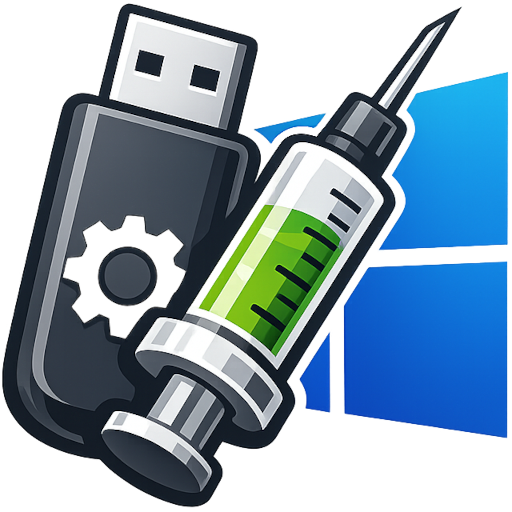

# I.D.I.O.T.
### Image Driver Integration &amp; Optimization Tool 

<p align="center">
  
</p>

## Features

- ✅ **ISO Support**: Extract, modify, and recreate Windows installer ISO files
- ✅ **WIM Support**: Direct WIM file processing
- ✅ **Driver Injection**: Inject multiple drivers from one or more directories
- ✅ **Logging**: Comprehensive logging of all operations, including failed driver injections
- ✅ **Optimization**: Optional WIM file optimization and shrinking
- ✅ **Modern GUI**: User-friendly Windows Presentation Foundation (WPF) interface
- ✅ **CLI Support**: Full command-line interface for automation and scripting
- ✅ **Portable**: Self-contained executable with no external dependencies (except Windows built-in tools)
- ✅ **Open Source**: 100% open source, no proprietary components

## Requirements

### Runtime Requirements

- **Windows 10/11** or **Windows PE** (Windows Preinstallation Environment)
- **DISM** (Deployment Image Servicing and Management) - Built into Windows 10/11 and Windows PE
- **PowerShell** - For ISO extraction/creation (built into Windows 10/11)
- **Administrator privileges** - Required for DISM operations

### Build Requirements

- **.NET 8.0 SDK** or later
- **Visual Studio 2022** (recommended) or **Visual Studio Code** with C# extension

## Installation

### Option 1: Build from Source

The recommended way to build is with the included `build-package.ps1` script:

1. Clone or download this repository
2. Ensure [.NET 8.0 SDK](https://dotnet.microsoft.com/download/dotnet/8.0) is installed
3. From the repository root, run:
   ```powershell
   .\build-package.ps1
   ```
4. Outputs:
   - **Published files**: `publish\win-x64\` — run `idiot.exe` directly
   - **Portable ZIP**: `publish\idiot-v{version}-win-x64-portable.zip` — extract and run
   - **Installer** (if Inno Setup 6 is installed): `publish\idiot-v{version}-win-x64-installer.exe`

**Script parameters** (all optional):

| Parameter | Default | Description |
|-----------|---------|-------------|
| `-Configuration` | Release | Build configuration |
| `-Runtime` | win-x64 | Target runtime (e.g. win-x86, win-arm64) |
| `-Version` | 0.1.0 | Version string for output filenames |
| `-SkipInstaller` | — | Skip Inno Setup installer (e.g. if not installed) |

Example: build with a specific version and skip the installer:
```powershell
.\build-package.ps1 -Version 1.0.0 -SkipInstaller
```

### Option 2: Pre-built Executable

Download the latest release from the releases page (when available).

## Usage

### Graphical User Interface (GUI)

1. Run `WIMISODriverInjector.exe`
2. Click **Browse...** next to "Input File" and select your ISO or WIM file
3. Specify the output file path (or use the auto-suggested name)
4. Click **Add Directory...** to add directories containing driver files (.inf)
5. (Optional) Adjust optimization settings and log file location
6. Click **Start Processing**
7. Monitor progress in the log output area
8. Check the log file for detailed information about driver injections

### Command Line Interface (CLI)

#### Basic Usage

```powershell
WIMISODriverInjector.exe --input "C:\path\to\install.iso" --output "C:\path\to\install_injected.iso" --drivers "C:\drivers\folder1" "C:\drivers\folder2"
```

#### Options

| Option | Short | Description | Required |
|--------|-------|-------------|----------|
| `--input` | `-i` | Path to input ISO or WIM file | Yes |
| `--output` | `-o` | Path to output ISO or WIM file | Yes |
| `--drivers` | `-d` | Directory or directories containing driver files (.inf) | Yes |
| `--log` | `-l` | Path to log file (default: `injection-log.txt`) | No |
| `--optimize` | `--shrink` | Optimize and shrink WIM file after injection (default: true) | No |

#### Examples

**Process an ISO file:**
```powershell
WIMISODriverInjector.exe -i "Windows.iso" -o "Windows_with_drivers.iso" -d "C:\Drivers\Network" "C:\Drivers\Storage"
```

**Process a WIM file without optimization:**
```powershell
WIMISODriverInjector.exe -i "install.wim" -o "install_injected.wim" -d "C:\Drivers" --optimize false
```

**Specify custom log file:**
```powershell
WIMISODriverInjector.exe -i "Windows.iso" -o "Windows_injected.iso" -d "C:\Drivers" -l "C:\Logs\driver-injection.log"
```

## How It Works

### ISO Processing

1. **Extraction**: The ISO file is mounted and extracted to a temporary directory
2. **WIM Discovery**: All WIM files within the ISO are located
3. **Driver Injection**: Each WIM file is processed:
   - Mounted using DISM
   - Drivers are injected into each image index
   - Changes are committed
   - WIM is unmounted
4. **Optimization** (optional): WIM files are optimized and compressed
5. **ISO Recreation**: A new ISO file is created with the modified WIM files

### WIM Processing

1. **Index Discovery**: All image indexes in the WIM file are identified
2. **Mounting**: Each image index is mounted to a temporary directory
3. **Driver Injection**: Drivers are injected using DISM's `/Add-Driver` command
4. **Commit**: Changes are committed to the WIM file
5. **Optimization** (optional): The WIM file is exported with maximum compression

### Driver Injection

- The tool searches for all `.inf` files in the specified driver directories (recursively)
- Each driver is injected using DISM's `/Add-Driver` command
- Success and failure of each driver injection is logged
- Failed drivers are logged with the reason for failure

## Logging

The application creates detailed logs of all operations:

- **Timestamp**: Each log entry includes a timestamp
- **Log Levels**: INFO, WARNING, ERROR, SUCCESS, DRIVER_FAILED
- **Driver Failures**: Each failed driver injection is logged with:
  - Driver file path
  - Reason for failure
- **Operation Details**: All DISM operations and their results

Log file location:
- **GUI**: Specified in the "Log File" field (default: `injection-log.txt`)
- **CLI**: Specified with `--log` option (default: `injection-log.txt`)

## Troubleshooting

### Common Issues

**"DISM mount failed"**
- Ensure you're running as Administrator
- Check that the WIM file is not corrupted
- Verify there's enough disk space in the temp directory

**"No WIM files found in ISO"**
- Verify the ISO is a valid Windows installer ISO
- Check that the ISO contains WIM files (typically in `sources\install.wim`)

**"ISO creation failed"**
- For Windows 10 versions before 1803, you may need `oscdimg.exe` from Windows ADK
- Windows 10 1803+ includes PowerShell's `New-IsoFile` cmdlet
- Ensure sufficient disk space for the output ISO

**"Driver injection failed"**
- Verify driver files are valid Windows drivers (.inf files)
- Check that drivers are compatible with the Windows version in the WIM
- Review the log file for specific error messages

**"Access denied" errors**
- Run the application as Administrator
- Ensure output file location is writable
- Check that input files are not in use by other applications

### Performance Tips

- **Disk Space**: Ensure you have at least 2-3x the size of your ISO/WIM file available for temporary files
- **Processing Time**: Large WIM files with many drivers can take 30+ minutes
- **Multiple Images**: WIM files with multiple image indexes will take longer to process

## Technical Details

### Dependencies

- **.NET 8.0 Runtime**: Self-contained, no installation required
- **DISM**: Windows built-in tool for WIM manipulation
- **PowerShell**: For ISO mounting/extraction (Windows 10+)
- **oscdimg.exe**: Optional, for ISO creation on older Windows versions

### Architecture

- **Core**: `ImageProcessor` class handles all WIM/ISO operations
- **Logging**: `Logger` class provides comprehensive logging
- **GUI**: WPF-based modern interface
- **CLI**: System.CommandLine for command-line parsing

### Portability

The application is published as a self-contained single-file executable:
- No .NET installation required
- All dependencies bundled
- Can run from USB drive or network share
- Compatible with Windows PE environments

## Limitations

- **Windows Only**: This tool only works on Windows (uses DISM and Windows-specific tools)
- **ISO Creation**: Requires Windows 10 1803+ or Windows ADK for older versions
- **Administrator Required**: DISM operations require elevated privileges
- **Single-threaded**: Driver injection is sequential (one driver at a time)

## Contributing

Contributions are welcome! Please feel free to submit issues, feature requests, or pull requests.

## License

This project is open source. Please see the LICENSE file for details.

## Disclaimer

This tool modifies Windows installer images. Always:
- Test modified ISOs/WIMs in a virtual machine first
- Keep backups of original files
- Verify driver compatibility before injection
- Use at your own risk

## Support

For issues, questions, or contributions:
- Open an issue on GitHub
- Check the log file for detailed error information
- Ensure you're running the latest version

## Version History

### Version 1.0.0
- Initial release
- ISO and WIM file support
- Driver injection with logging
- WIM optimization
- Modern GUI and CLI interfaces
- Portable self-contained executable
